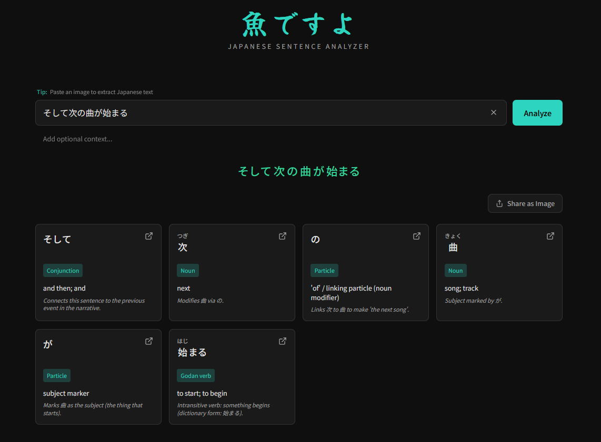
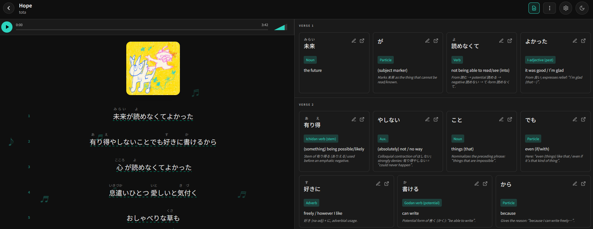

# sakanadesuyo

This is a web app to help you learn Japanese. It's meant to be a tool you can
use when you're reading something, or listening to a song, and you get stuck -
you see a bunch of words you recognize, but you don't understand the sentence as
a whole.

You can try it live at [sakana.amogus.it](https://sakana.amogus.it/).

The base idea is the same as [ichi.moe](https://ichi.moe/), but using LLMs to
parse the Japanese. This project was actually born as a test of the capabilities
of modern coding agents, and was mostly built by
[Google Antigravity](https://antigravity.dev/). I gotta say, I was impressed. It
may not be perfect, but it works. And most importantly, building this was _fun_.

## Security and Data Privacy

If you use this apps, the sentences you analyze will pass through OpenRouter and
be processed by an LLM. By default it'll be an OpenAI model, but you can change
that by clicking on the settings button in the top right corner.

I've included some server-side logging to track errors and metrics like latency.
Since the web app is using my API keys, I'm also tracking usage - specifically
the length of the sentences you're analyzing, which model you're using, and the
number of input tokens and tokens generated.

Everything else, like the notes, the songs you're analyzing, etc. is stored
locally in your browser. This helps me avoid any hosting cost, but it also means
that everything will be lost if you clear your browser data. And also you can
only access your notes on the device you created them on.

As for security, this is effectively just a fancy UI for LLM API calls, so
whatever you try to do, nothing too bad can happen.

## Features

- **/**: Write a sentence and click "Analyze" to get a word-by-word background.

    

- **/notebook**: A text editor integrated with the sentence analyzer.

- **/karaoke**: Analyze song lyrics with synchronized translations and breakdown
  of Japanese grammar.

    

## Development

### Prerequisites

- Node.js (or Bun)
- npm (or bun)

### Setup & Run

First, you will need to get an API key from
[OpenRouter](https://openrouter.ai/). You will also need some credits.

Put the API key in the .env file as OPENROUTER_API_KEY.

Then install the dependencies and start the development server:

```bash
npm install # or bun install
npm run dev # or bun dev
```

The application will be available at `http://localhost:5173`.

### Tests

The project uses **Playwright** for End-to-End (E2E) testing.

To run the tests:

```bash
npm run e2e      # Run all E2E tests
npm run e2e:mock # Run tests with mock API (faster, no external calls)
npm run check    # Verify types and code quality
```

## Documentation

For more detailed information, check out:

- [Design System](docs/design.md)
- [Deployment Guide](docs/deployment.md)
